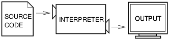
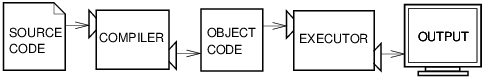

::: {#notebook .border-box-sizing tabindex="-1"}
::: {#notebook-container .container}
::: {.cell .border-box-sizing .text_cell .rendered}
::: {.prompt .input_prompt}
:::

::: {.inner_cell}
::: {.text_cell_render .border-box-sizing .rendered_html}
첫 프로그래밍[¶](#첫-프로그래밍){.anchor-link}
==============================================
:::
:::
:::

::: {.cell .border-box-sizing .text_cell .rendered}
::: {.prompt .input_prompt}
:::

::: {.inner_cell}
::: {.text_cell_render .border-box-sizing .rendered_html}
프로그래밍을 스스로 할줄 알면, 우선 컴퓨터를 단순히 사용하는 것을 넘어
제어하는 방법을 배우게 된다. 또한 프로그래밍을 할 수록 더 창의적이 되며,
더 정확하게 생각하게 되고, 문제를 논리적으로 분석하고 해결하는 능력도
배양하게 된다.

그런데 프로그래밍을 하려면 어떻게 해야 하는가? 카카오톡, 트위터,
페이스북과 같은 소프트웨어를 구현하려면 무엇을 어떻게 배워야 하는가?

물론 처음부터 그러한 위대한 소프트웨어를 프로그래밍할 수는 없다. 하지만
그러한 소프트웨어를 구현하기 위해서는 프로그래밍을 제대로 할 수 있어야
한다는 사실은 너무나도 자명하다. 결국, 프로그래밍을 먼저 배워야 한다.
쉽고 간단한 것부터 시작해보자.
:::
:::
:::

::: {.cell .border-box-sizing .text_cell .rendered}
::: {.prompt .input_prompt}
:::

::: {.inner_cell}
::: {.text_cell_render .border-box-sizing .rendered_html}
먼저, 아래 파이썬 코드를 읽어 보면서 아래 코드의 의미, 즉 아래 코드를
실행하면 어떤 일을 하는지 알아본다. 찬찬히 읽으면 파이썬 언어를 전혀
모른다 해도 코드가 하는 일을 이해할 수 있다.

------------------------------------------------------------------------

::: {.highlight}
    print("Welcome")
    g = input("Guess the number: ")
    guess = int(g)
    if guess == 5:
        print("You win!")
    else:
        print("You lose!")
    print("Game over!")
:::

------------------------------------------------------------------------
:::
:::
:::

::: {.cell .border-box-sizing .text_cell .rendered}
::: {.prompt .input_prompt}
:::

::: {.inner_cell}
::: {.text_cell_render .border-box-sizing .rendered_html}
**코드설명**

-   위 코드는 숫자 5를 맞추는 게임이다.
-   참여자가 임의의 숫자를 입력하여 숫자 5를 맞추면 \"You win\"을,
    아니면 \"You lose!\"를 출력한다.
-   `if`, `else`는 파이썬 키워드,
-   `g`, `guess`는 변수,
-   `print`, `input`, `int`는 함수이다.
-   이중에 아마도 `int`의 의미만 불확실할 것이며 다른 것들은 의미가
    명확하다. (`int` 함수의 의미는 나중에 배운다.)
:::
:::
:::

::: {.cell .border-box-sizing .text_cell .rendered}
::: {.prompt .input_prompt}
:::

::: {.inner_cell}
::: {.text_cell_render .border-box-sizing .rendered_html}
파이썬 프로그램 실행하기[¶](#파이썬-프로그램-실행하기){.anchor-link}
--------------------------------------------------------------------
:::
:::
:::

::: {.cell .border-box-sizing .text_cell .rendered}
::: {.prompt .input_prompt}
:::

::: {.inner_cell}
::: {.text_cell_render .border-box-sizing .rendered_html}
### 파이썬 코드 실행하기[¶](#파이썬-코드-실행하기){.anchor-link}

파이썬은 소스코드를 컴파일 없이 바로 실행시킬 수 있다. 물론 파이썬
언어를 컴퓨터 CPU가 바로 이해하지는 못한다. 따라서 파이썬 소스코드를
컴퓨터가 이해할 수 있는 언어로 해석을 해주어야 하는 데, 이 기능을
수행하는 것을 해석기(인터프리터)라고 한다. 즉, 파이썬 언어는 컴파일러
대신에 해석기를 이용하여 코드의 의미를 CPU에 전달하며, CPU는 전달된
내용을 바로 실행한다. C 언어 또는 Java와 달리 소스코드를 한줄한줄
실행시킬 수도 있다. 예를 들어 위 코드의 처음 몇 줄을 따로따로 실행하면
다음과 같다.
:::
:::
:::

::: {.cell .border-box-sizing .code_cell .rendered}
::: {.input}
::: {.prompt .input_prompt}
In \[1\]:
:::

::: {.inner_cell}
::: {.input_area}
::: {.highlight .hl-ipython3}
    print("Welcome")
:::
:::
:::
:::

::: {.output_wrapper}
::: {.output}
::: {.output_area}
::: {.prompt}
:::

::: {.output_subarea .output_stream .output_stdout .output_text}
    Welcome
:::
:::
:::
:::
:::

::: {.cell .border-box-sizing .code_cell .rendered}
::: {.input}
::: {.prompt .input_prompt}
In \[2\]:
:::

::: {.inner_cell}
::: {.input_area}
::: {.highlight .hl-ipython3}
    g = input("Guess the number: ")
:::
:::
:::
:::

::: {.output_wrapper}
::: {.output}
::: {.output_area}
::: {.prompt}
:::

::: {.output_subarea .output_stream .output_stdout .output_text}
    Guess the number: 6
:::
:::
:::
:::
:::

::: {.cell .border-box-sizing .text_cell .rendered}
::: {.prompt .input_prompt}
:::

::: {.inner_cell}
::: {.text_cell_render .border-box-sizing .rendered_html}
`input` 함수는 키보드를 이용하여 입력받은 임의의 키보드 조합을
**문자열**로 리턴하는 함수이다. 위 코드에서 변수 `g`에는 `input` 함수에
의해 리턴되는 값이 할당된다.

**주의사항:**

-   `input`은 입력된 값을 모두 문자열로 처리해서 리턴한다.
-   따라서 숫자 8을 입력하다라도 숫자가 아닌 문자열 `"8"`이 변수 `g`에
    할당된다. 이것은 `g`의 자료형을 `type` 함수를 이용하여 확인할 수
    있다.
:::
:::
:::

::: {.cell .border-box-sizing .code_cell .rendered}
::: {.input}
::: {.prompt .input_prompt}
In \[3\]:
:::

::: {.inner_cell}
::: {.input_area}
::: {.highlight .hl-ipython3}
    type(g)
:::
:::
:::
:::

::: {.output_wrapper}
::: {.output}
::: {.output_area}
::: {.prompt .output_prompt}
Out\[3\]:
:::

::: {.output_text .output_subarea .output_execute_result}
    int
:::
:::
:::
:::
:::

::: {.cell .border-box-sizing .text_cell .rendered}
::: {.prompt .input_prompt}
:::

::: {.inner_cell}
::: {.text_cell_render .border-box-sizing .rendered_html}
실제로 `g`에 할당된 값을 확인해도 문자열 `8`이 보여진다.
:::
:::
:::

::: {.cell .border-box-sizing .code_cell .rendered}
::: {.input}
::: {.prompt .input_prompt}
In \[4\]:
:::

::: {.inner_cell}
::: {.input_area}
::: {.highlight .hl-ipython3}
    g
:::
:::
:::
:::

::: {.output_wrapper}
::: {.output}
::: {.output_area}
::: {.prompt .output_prompt}
Out\[4\]:
:::

::: {.output_text .output_subarea .output_execute_result}
    6
:::
:::
:::
:::
:::

::: {.cell .border-box-sizing .text_cell .rendered}
::: {.prompt .input_prompt}
:::

::: {.inner_cell}
::: {.text_cell_render .border-box-sizing .rendered_html}
반면에 숫자 5의 자료형은 `int`, 즉 정수형이다.
:::
:::
:::

::: {.cell .border-box-sizing .code_cell .rendered}
::: {.input}
::: {.prompt .input_prompt}
In \[5\]:
:::

::: {.inner_cell}
::: {.input_area}
::: {.highlight .hl-ipython3}
    type(5)
:::
:::
:::
:::

::: {.output_wrapper}
::: {.output}
::: {.output_area}
::: {.prompt .output_prompt}
Out\[5\]:
:::

::: {.output_text .output_subarea .output_execute_result}
    int
:::
:::
:::
:::
:::

::: {.cell .border-box-sizing .text_cell .rendered}
::: {.prompt .input_prompt}
:::

::: {.inner_cell}
::: {.text_cell_render .border-box-sizing .rendered_html}
따라서 서로 자료형이 다른 문자열 `'8'`과 숫자 5는 비교할 수 없는
대상이다. 실제로 동일여부를 확인하면 틀리다라도 답이 나온다.
:::
:::
:::

::: {.cell .border-box-sizing .code_cell .rendered}
::: {.input}
::: {.prompt .input_prompt}
In \[6\]:
:::

::: {.inner_cell}
::: {.input_area}
::: {.highlight .hl-ipython3}
    '8' == 5
:::
:::
:::
:::

::: {.output_wrapper}
::: {.output}
::: {.output_area}
::: {.prompt .output_prompt}
Out\[6\]:
:::

::: {.output_text .output_subarea .output_execute_result}
    False
:::
:::
:::
:::
:::

::: {.cell .border-box-sizing .text_cell .rendered}
::: {.prompt .input_prompt}
:::

::: {.inner_cell}
::: {.text_cell_render .border-box-sizing .rendered_html}
**주의사항:**

-   `'8'`과 5가 숫자가 다르다고 해서 `False`가 나온 것이 아니라 두 값의
    자료형이 다르기 때문이다.
-   `'8'`과 8을 비교해도 다르다고 나온다.
:::
:::
:::

::: {.cell .border-box-sizing .code_cell .rendered}
::: {.input}
::: {.prompt .input_prompt}
In \[7\]:
:::

::: {.inner_cell}
::: {.input_area}
::: {.highlight .hl-ipython3}
    '8' == 8
:::
:::
:::
:::

::: {.output_wrapper}
::: {.output}
::: {.output_area}
::: {.prompt .output_prompt}
Out\[7\]:
:::

::: {.output_text .output_subarea .output_execute_result}
    False
:::
:::
:::
:::
:::

::: {.cell .border-box-sizing .text_cell .rendered}
::: {.prompt .input_prompt}
:::

::: {.inner_cell}
::: {.text_cell_render .border-box-sizing .rendered_html}
문자열과 정수는 문법적으로 서로 다른 자료형이고 서로 다른 자료형에
속하는 값들은 무조건 다르다고 판단된다.

따라서, `input`을 이용하여 입력된 값을 정수 `5`와 비교하려면 먼저 두
값의 자료형을 통일시켜야 한다. 여기서는 `int` 함수를 이용하여 숫자로만
이루어진 문자열을 정수 자료형으로 변환하는 것을 선택하였다.
:::
:::
:::

::: {.cell .border-box-sizing .code_cell .rendered}
::: {.input}
::: {.prompt .input_prompt}
In \[8\]:
:::

::: {.inner_cell}
::: {.input_area}
::: {.highlight .hl-ipython3}
    guess = int(g)
:::
:::
:::
:::
:::

::: {.cell .border-box-sizing .text_cell .rendered}
::: {.prompt .input_prompt}
:::

::: {.inner_cell}
::: {.text_cell_render .border-box-sizing .rendered_html}
여기까지 실행하고 `guess` 변수에 할당된 값을 확인하면 앞서 입력한 값을
확인할 수 있다.
:::
:::
:::

::: {.cell .border-box-sizing .code_cell .rendered}
::: {.input}
::: {.prompt .input_prompt}
In \[9\]:
:::

::: {.inner_cell}
::: {.input_area}
::: {.highlight .hl-ipython3}
    guess
:::
:::
:::
:::

::: {.output_wrapper}
::: {.output}
::: {.output_area}
::: {.prompt .output_prompt}
Out\[9\]:
:::

::: {.output_text .output_subarea .output_execute_result}
    6
:::
:::
:::
:::
:::

::: {.cell .border-box-sizing .text_cell .rendered}
::: {.prompt .input_prompt}
:::

::: {.inner_cell}
::: {.text_cell_render .border-box-sizing .rendered_html}
`guess`에 저장된 값의 자료형을 확인하면 정수형임을 알 수 있다.
:::
:::
:::

::: {.cell .border-box-sizing .code_cell .rendered}
::: {.input}
::: {.prompt .input_prompt}
In \[10\]:
:::

::: {.inner_cell}
::: {.input_area}
::: {.highlight .hl-ipython3}
    type(guess)
:::
:::
:::
:::

::: {.output_wrapper}
::: {.output}
::: {.output_area}
::: {.prompt .output_prompt}
Out\[10\]:
:::

::: {.output_text .output_subarea .output_execute_result}
    int
:::
:::
:::
:::
:::

::: {.cell .border-box-sizing .text_cell .rendered}
::: {.prompt .input_prompt}
:::

::: {.inner_cell}
::: {.text_cell_render .border-box-sizing .rendered_html}
**주의:**

-   `int` 함수는 자연수로만 구성된 문자열을 처리할 수 있다.
-   입력값이 실수 모양의 문자열이거나 다른 종류의 문자열이면 오류가
    발생한다.
:::
:::
:::

::: {.cell .border-box-sizing .code_cell .rendered}
::: {.input}
::: {.prompt .input_prompt}
In \[11\]:
:::

::: {.inner_cell}
::: {.input_area}
::: {.highlight .hl-ipython3}
    int("11.3")
:::
:::
:::
:::

::: {.output_wrapper}
::: {.output}
::: {.output_area}
::: {.prompt}
:::

::: {.output_subarea .output_text .output_error}
    ---------------------------------------------------------------------------
    ValueError                                Traceback (most recent call last)
    <ipython-input-11-e63dedef32e0> in <module>()
    ----> 1 int("11.3")

    ValueError: invalid literal for int() with base 10: '11.3'
:::
:::
:::
:::
:::

::: {.cell .border-box-sizing .code_cell .rendered}
::: {.input}
::: {.prompt .input_prompt}
In \[12\]:
:::

::: {.inner_cell}
::: {.input_area}
::: {.highlight .hl-ipython3}
    int("abc")
:::
:::
:::
:::

::: {.output_wrapper}
::: {.output}
::: {.output_area}
::: {.prompt}
:::

::: {.output_subarea .output_text .output_error}
    ---------------------------------------------------------------------------
    ValueError                                Traceback (most recent call last)
    <ipython-input-12-908f2fe4faa4> in <module>()
    ----> 1 int("abc")

    ValueError: invalid literal for int() with base 10: 'abc'
:::
:::
:::
:::
:::

::: {.cell .border-box-sizing .text_cell .rendered}
::: {.prompt .input_prompt}
:::

::: {.inner_cell}
::: {.text_cell_render .border-box-sizing .rendered_html}
### 인터프리터 vs 컴파일러[¶](#인터프리터-vs-컴파일러){.anchor-link}
:::
:::
:::

::: {.cell .border-box-sizing .text_cell .rendered}
::: {.prompt .input_prompt}
:::

::: {.inner_cell}
::: {.text_cell_render .border-box-sizing .rendered_html}
#### 인터프리터 사용 언어[¶](#인터프리터-사용-언어){.anchor-link}

앞서 설명한 것과 같이 코드를 한줄한줄 실행할 수 있는 언어를 **해석기
사용 언어** 또는 **스크립트 언어**라고 부르며, 파이썬 코드를 해석하여
실행할 수 있도록 하는 것을 **해석기(인터프리터)**라고 한다. 해석기가
작동하는 방식은 아래 그림과 같다.

  -----------------------------------
  
  -----------------------------------

그림 출처: [Think Python: How to Think Like a Computer
Scientist](http://www.greenteapress.com/thinkpython/html/thinkpython002.html#toc4)
:::
:::
:::

::: {.cell .border-box-sizing .text_cell .rendered}
::: {.prompt .input_prompt}
:::

::: {.inner_cell}
::: {.text_cell_render .border-box-sizing .rendered_html}
**예제:** 앞서 언급한 \"숫자 맞추기 게임\"을 해석기를 이용하여 바로
실행할 수 있다.
:::
:::
:::

::: {.cell .border-box-sizing .code_cell .rendered}
::: {.input}
::: {.prompt .input_prompt}
In \[13\]:
:::

::: {.inner_cell}
::: {.input_area}
::: {.highlight .hl-ipython3}
    print("Welcome")
    g = input("Guess the number: ")
    guess = int(g)
    if guess == 5:
        print("You win!")
    else:
        print("You lose!")
    print("Game over!")
:::
:::
:::
:::

::: {.output_wrapper}
::: {.output}
::: {.output_area}
::: {.prompt}
:::

::: {.output_subarea .output_stream .output_stdout .output_text}
    Welcome
    Guess the number: 6
    You lose!
    Game over!
:::
:::
:::
:::
:::

::: {.cell .border-box-sizing .text_cell .rendered}
::: {.prompt .input_prompt}
:::

::: {.inner_cell}
::: {.text_cell_render .border-box-sizing .rendered_html}
#### 컴파일러 사용 언어[¶](#컴파일러-사용-언어){.anchor-link}

반면에 C 언어와 Java 언어의 경우는 **컴파일러 사용 언어**라 불린다.
컴파이러는 소스코드를 일괄적으로 대상코드(object code)로 변환시킨다.
변화 과정에서 소스코드 전체를 기계가 이해할 수 있는 저수준 언어로
번역하면서 링크과정 등 기타 다른 일들을 수행한다. 파이썬의 경우와는 달리
소스코드가 아닌 대상코드를 실행하게 된다. 컴파일 과정은 그림으로
나타내면 아래와 같다.

  -----------------------------------
  
  -----------------------------------

그림 출처: [Think Python: How to Think Like a Computer
Scientist](http://www.greenteapress.com/thinkpython/html/thinkpython002.html#toc4)
:::
:::
:::

::: {.cell .border-box-sizing .text_cell .rendered}
::: {.prompt .input_prompt}
:::

::: {.inner_cell}
::: {.text_cell_render .border-box-sizing .rendered_html}
**예제: C 코드 예제**

C 언어의 경우 코드 상단에 헤더, 그 다음에는 main 함수 등이 있어야 한다.
또한 먼저 소스코드를 컴파일하여 목적코드로 변환한 다음에야 실행할 수
있다.

\"숫자 맞추기 게임\"을 C 코드로 다음과 같이 구현할 수 있다.

------------------------------------------------------------------------

::: {.highlight}
    #include <stdio.h>
    #include <stdlib.h>

    int main(void) {
        int guess;

        printf("Welcome!\n");
        printf("Guess the number: ");
        scanf("%d", &guess); 
        if(guess == 5) 
            printf("You win!\n"); 
        else
            printf("You lose!\n");
        printf("Game over!\n");
    //  system("pause");
        return 0;
    }
:::

------------------------------------------------------------------------
:::
:::
:::

::: {.cell .border-box-sizing .text_cell .rendered}
::: {.prompt .input_prompt}
:::

::: {.inner_cell}
::: {.text_cell_render .border-box-sizing .rendered_html}
**주의:** 아래 코드는 코드의 실행이 너무 빠르게 종료될 경우 콘솔창이
사라지지 않도록 하는 명령어이며, 일반적으로는 필요하지 않은 코드이다.

::: {.highlight}
    system("pause");
:::
:::
:::
:::

::: {.cell .border-box-sizing .text_cell .rendered}
::: {.prompt .input_prompt}
:::

::: {.inner_cell}
::: {.text_cell_render .border-box-sizing .rendered_html}
프로그램 구상하기[¶](#프로그램-구상하기){.anchor-link}
------------------------------------------------------
:::
:::
:::

::: {.cell .border-box-sizing .text_cell .rendered}
::: {.prompt .input_prompt}
:::

::: {.inner_cell}
::: {.text_cell_render .border-box-sizing .rendered_html}
-   목표: 숫자 맞추기 게임 개발

-   목표를 달성하기 위해 프로그램을 어떻게 구현할지 구상을 먼저 해야 함.

-   게임 구현에 필요 요소 확인

    -   사용자로부터 입력 받아 저장하는 수단: `input` 함수 활용
    -   두 개의 숫자를 비교하는 수단: 동일 값 여부 비교(`==`) 불리언
        연산자 활용
    -   판단을 하고 판단 결과에 따라 다른 일을 하도록 하는 수단:
        `if ... else ...` 명령문 활용
    -   출력 수단: `print` 함수 활용
:::
:::
:::

::: {.cell .border-box-sizing .text_cell .rendered}
::: {.prompt .input_prompt}
:::

::: {.inner_cell}
::: {.text_cell_render .border-box-sizing .rendered_html}
앞서 언급한 \"숫자 맞추기 게임\"의 필수요소를 적절히 활용하여 배치해야
하며, 이 부분을 배우고 기억해야 한다. 아래 코드는 앞서 실행한 코드와
동일하다. 대신에 각각의 명령문이 왜 그곳에 위치하였는가를 앞서 설명한
필수요소를 주석으로 함께 표시하고 있다.
:::
:::
:::

::: {.cell .border-box-sizing .code_cell .rendered}
::: {.input}
::: {.prompt .input_prompt}
In \[14\]:
:::

::: {.inner_cell}
::: {.input_area}
::: {.highlight .hl-ipython3}
    # 환영인사 출력
    print("Welcome")

    # 사용자로부터 값 입력받기
    g = input("Guess the number: ")
    guess = int(g)

    # 값을 비교하여 결과에 따라 다른 명령문 실행하기
    if guess == 5:
        print("You win!")
    else:
        print("You lose!")
        
    # 종료 확인 출력    
    print("Game over!")
:::
:::
:::
:::

::: {.output_wrapper}
::: {.output}
::: {.output_area}
::: {.prompt}
:::

::: {.output_subarea .output_stream .output_stdout .output_text}
    Welcome
    Guess the number: 6
    You lose!
    Game over!
:::
:::
:::
:::
:::

::: {.cell .border-box-sizing .text_cell .rendered}
::: {.prompt .input_prompt}
:::

::: {.inner_cell}
::: {.text_cell_render .border-box-sizing .rendered_html}
프로그램 수준 높이기 1[¶](#프로그램-수준-높이기-1){.anchor-link}
----------------------------------------------------------------

앞서 사용한 \"숫자 맞추기 게임\" 코드는 사용자에게 불공평한 게임을
제공한다. 맞춰야 하는 숫자에 대한 아무런 정보를 주지 않기 때문이다.

형평성을 높이기 위해 사용자가 입력한 값이 맞추어야 하는 숫자와 비교해서
큰지, 작은지, 같은지 여부를 알려줄 수 있도록 프로그램을 작성하면 아래와
같다.

예를 들어, 3을 입력하면 \"너무 작다\"(\"Too low\")를, 7을 입력하면
\"너무 크다\"(\"Too high\")를 출력한다.
:::
:::
:::

::: {.cell .border-box-sizing .code_cell .rendered}
::: {.input}
::: {.prompt .input_prompt}
In \[15\]:
:::

::: {.inner_cell}
::: {.input_area}
::: {.highlight .hl-ipython3}
    print("Welcome")
    g = input("Guess the number: ")
    guess = int(g)
    if guess == 5:
        print("You win!")
    else:
        if guess > 5:
            print("Too high")
        else:
            print("Too low")
    print("Game over!")
:::
:::
:::
:::

::: {.output_wrapper}
::: {.output}
::: {.output_area}
::: {.prompt}
:::

::: {.output_subarea .output_stream .output_stdout .output_text}
    Welcome
    Guess the number: 3
    Too low
    Game over!
:::
:::
:::
:::
:::

::: {.cell .border-box-sizing .code_cell .rendered}
::: {.input}
::: {.prompt .input_prompt}
In \[16\]:
:::

::: {.inner_cell}
::: {.input_area}
::: {.highlight .hl-ipython3}
    print("Welcome")
    g = input("Guess the number: ")
    guess = int(g)
    if guess == 5:
        print("You win!")
    else:
        if guess > 5:
            print("Too high")
        else:
            print("Too low")
    print("Game over!")
:::
:::
:::
:::

::: {.output_wrapper}
::: {.output}
::: {.output_area}
::: {.prompt}
:::

::: {.output_subarea .output_stream .output_stdout .output_text}
    Welcome
    Guess the number: 7
    Too high
    Game over!
:::
:::
:::
:::
:::

::: {.cell .border-box-sizing .text_cell .rendered}
::: {.prompt .input_prompt}
:::

::: {.inner_cell}
::: {.text_cell_render .border-box-sizing .rendered_html}
**주의사항: 들여쓰기**

-   파이썬에서는 들여쓰기가 선택사항이 아니다.
-   위 코드에서 5번 줄은 `if`문의 본체이므로 반드시 한 번 들여쓰기를
    해야 한다.
-   7번, 9번 줄도 `else`문의 본체이므로 동일하게 들여쓰기를 해야 한다.
-   반면에 8번 줄의 경우 중첩된 `if` 문의 본체이므로 들여쓰기를 두 번
    해야한다.
-   10번 줄도 동일한 규칙이 적용된다.
-   `if`, `else`, `while`, `for` 문은 기본적으로 콜론(`:`)을 문장 끝에
    사용해야 하고 본체는 들여 써야 한다.
-   들여쓰기는 기본적으로 탭키를 이용한다.
:::
:::
:::

::: {.cell .border-box-sizing .text_cell .rendered}
::: {.prompt .input_prompt}
:::

::: {.inner_cell}
::: {.text_cell_render .border-box-sizing .rendered_html}
프로그램 수준 높이기 2[¶](#프로그램-수준-높이기-2){.anchor-link}
----------------------------------------------------------------

바로 위에서 수정한 코드는 원래 코드보다 형평성을 좀 더 보장한다. 그런데
추측한 값이 틀려도 게임이 바로 멈춘다. 새로운 추측을 하려면 게임을 다시
실행시켜야 해서 불편하다. 답을 맞출 때까지 게임이 반복되도록 코드를
수정해보자.

**힌트:** `while` 명령문을 이용하면 된다.
:::
:::
:::

::: {.cell .border-box-sizing .text_cell .rendered}
::: {.prompt .input_prompt}
:::

::: {.inner_cell}
::: {.text_cell_render .border-box-sizing .rendered_html}
### `while` 명령문[¶](#while-명령문){.anchor-link}

`while` 명령문은 특정 조건이 성립하는 조건에서 특정 코드를 반복해서
실행하기 위해서 사용되며, 아래와 같은 모양을 갖는다.

::: {.highlight}
    while 조건문:
        본체
:::

-   조건문: 참(`True`)과 거짓(`False`)으로 판별될 수 있는 문장 의미
-   본체: 임의의 파이썬 코드가 사용됨
    -   반드시 들여쓰기를 사용해야 함

이제 우리가 원하는 대로 `while` 문을 작성하기 위해서는 조건문과 본체에
들어갈 코드를 선택해야 한다.

-   본체 선택 기준: 무슨 일을 반복할 것인지 판단해야 함.
-   조건문 선택 기준: 동일한 일을 어떤 조건하에서 반복할지 판단해야 함.

**예제:** 숫자 맞추기 게임

-   본체: 숫자를 선택하고 선택된 숫자를 정수 5와 비교하여 이겼다, 너무
    크다, 너무 작다를 판단하는 일.
-   조건문: 선택된 숫자가 정수 5와 다르다는 조건. 그래야만 새로운 숫자를
    선택할 수 있기 때문.

따라서 아래와 같이 `while` 명령문을 이용하여 코드를 작성할 수 있다.
:::
:::
:::

::: {.cell .border-box-sizing .code_cell .rendered}
::: {.input}
::: {.prompt .input_prompt}
In \[17\]:
:::

::: {.inner_cell}
::: {.input_area}
::: {.highlight .hl-ipython3}
    print("Welcome")
    guess = 0
    while guess != 5:
        g = input("Guess the number: ")
        guess = int(g)
        if guess == 5:
            print("You win!")
        else:
            if guess > 5:
                print("Too high")
            else:
                print("Too low")
    print("Game over!")
:::
:::
:::
:::

::: {.output_wrapper}
::: {.output}
::: {.output_area}
::: {.prompt}
:::

::: {.output_subarea .output_stream .output_stdout .output_text}
    Welcome
    Guess the number: 3
    Too low
    Guess the number: 7
    Too high
    Guess the number: 5
    You win!
    Game over!
:::
:::
:::
:::
:::

::: {.cell .border-box-sizing .text_cell .rendered}
::: {.prompt .input_prompt}
:::

::: {.inner_cell}
::: {.text_cell_render .border-box-sizing .rendered_html}
**주의사항:**

-   위 코드에서 2번 줄에서 `guess` 변수를 초기화 하는 과정이 필요함에
    주의한다.
-   `while` 조건문에서 `guess` 변수의 값을 확인하려면 `guess` 변수가
    이미 선언되어 있어야 하기 때문이다.
:::
:::
:::

::: {.cell .border-box-sizing .text_cell .rendered}
::: {.prompt .input_prompt}
:::

::: {.inner_cell}
::: {.text_cell_render .border-box-sizing .rendered_html}
프로그램 수준 높이기 3[¶](#프로그램-수준-높이기-3){.anchor-link}
----------------------------------------------------------------

앞서 \'프로그램 수준 높이기 2\'에서 개선한 코드는 상당히 훌륭하다.
사용자가 숨은 값을 맞출 수 있도록 유도하며, 숫자 5을 맞추어야만
종료된다.

그런데 위 게임은 한 번 하면 더 이상 사용하지 않는다. 맞추어야 하는
숫자가 항상 5이기 때문이다. 따라서 위 게임을 좀 더 흥미롭게 만들기
위해서 맞추어야 하는 숫자를 게임이 실행될 때마다 임의로 변하도록 바꿀
필요가 있다. 파이썬에서 정수 숫자를 임의로 만들어주는 `randint` 라는
함수를 이용할 수 있다.

나머지 과정은 앞서의 코드와 동일하다. 다만, 정수 `5` 대신에 `randint`가
임의로 생성하는 값을 기억해 두고 그것을 맞추는 게임이 되도록 코드 일부만
수정하면 된다. 아래 코드에서는 숫자 `5` 대신에 `secret` 이란 변수가
임의로 생성되어 맞추어야 하는 숫자를 담는 그릇 역할을 수행한다.

**주의사항:**

-   `randint` 함수는 두 개의 정수 인자를 받으면 두 정수를 양끝으로 갖는
    구간에서 임의의 값을 정하여 리턴한다. 예를 들어, 1부터 10사이의 정수
    중에서 임의의 값을 선택하려면 `randint(1, 10)`이라 작성하면 된다.
-   `randint` 함수를 사용하기 위해서 `random` 이라는 모듈을 사용하겠다는
    명령을 내려야 한다.
-   전문용어로 `random` 모듈을 임포트(import)한다 또는 *불러 들인다*
    라고 하며 아래와 같이 `import` 키워드를 이용한다.
-   특정 모듈을 임포트하는 방법엔 여러 방식이 있다. 여기서는 특정
    모듈에서 특정 함수만을 임포트하는 방법을 배운다.

          from random import randint
:::
:::
:::

::: {.cell .border-box-sizing .code_cell .rendered}
::: {.input}
::: {.prompt .input_prompt}
In \[18\]:
:::

::: {.inner_cell}
::: {.input_area}
::: {.highlight .hl-ipython3}
    from random import randint
:::
:::
:::
:::
:::

::: {.cell .border-box-sizing .code_cell .rendered}
::: {.input}
::: {.prompt .input_prompt}
In \[19\]:
:::

::: {.inner_cell}
::: {.input_area}
::: {.highlight .hl-ipython3}
    secret = randint(1, 10)
    secret            
:::
:::
:::
:::

::: {.output_wrapper}
::: {.output}
::: {.output_area}
::: {.prompt .output_prompt}
Out\[19\]:
:::

::: {.output_text .output_subarea .output_execute_result}
    2
:::
:::
:::
:::
:::

::: {.cell .border-box-sizing .text_cell .rendered}
::: {.prompt .input_prompt}
:::

::: {.inner_cell}
::: {.text_cell_render .border-box-sizing .rendered_html}
`rantint` 함수는 실행될 때마다 다른 값을 되돌려준다.
:::
:::
:::

::: {.cell .border-box-sizing .code_cell .rendered}
::: {.input}
::: {.prompt .input_prompt}
In \[20\]:
:::

::: {.inner_cell}
::: {.input_area}
::: {.highlight .hl-ipython3}
    secret = randint(1, 10)
    secret            
:::
:::
:::
:::

::: {.output_wrapper}
::: {.output}
::: {.output_area}
::: {.prompt .output_prompt}
Out\[20\]:
:::

::: {.output_text .output_subarea .output_execute_result}
    5
:::
:::
:::
:::
:::

::: {.cell .border-box-sizing .code_cell .rendered}
::: {.input}
::: {.prompt .input_prompt}
In \[21\]:
:::

::: {.inner_cell}
::: {.input_area}
::: {.highlight .hl-ipython3}
    secret = randint(1, 10)
    secret            
:::
:::
:::
:::

::: {.output_wrapper}
::: {.output}
::: {.output_area}
::: {.prompt .output_prompt}
Out\[21\]:
:::

::: {.output_text .output_subarea .output_execute_result}
    8
:::
:::
:::
:::
:::

::: {.cell .border-box-sizing .text_cell .rendered}
::: {.prompt .input_prompt}
:::

::: {.inner_cell}
::: {.text_cell_render .border-box-sizing .rendered_html}
이제 수준 높은 \"숫자 맞추기 게임\"을 구현할 수 있다.
:::
:::
:::

::: {.cell .border-box-sizing .code_cell .rendered}
::: {.input}
::: {.prompt .input_prompt}
In \[22\]:
:::

::: {.inner_cell}
::: {.input_area}
::: {.highlight .hl-ipython3}
    from random import randint
    secret = randint(1, 10)

    print("Welcome")
    guess = 0
    while guess != secret:
        g = input("Guess the number: ")
        guess = int(g)
        if guess == secret:
            print("You win!")
        else:
            if guess > secret:
                print("Too high")
            else:
                print("Too low")
    print("Game over!")
:::
:::
:::
:::

::: {.output_wrapper}
::: {.output}
::: {.output_area}
::: {.prompt}
:::

::: {.output_subarea .output_stream .output_stdout .output_text}
    Welcome
    Guess the number: 3
    Too low
    Guess the number: 7
    Too low
    Guess the number: 9
    You win!
    Game over!
:::
:::
:::
:::
:::

::: {.cell .border-box-sizing .text_cell .rendered}
::: {.prompt .input_prompt}
:::

::: {.inner_cell}
::: {.text_cell_render .border-box-sizing .rendered_html}
정리: 이번에 사용한 파이썬 도구[¶](#정리:-이번에-사용한-파이썬-도구){.anchor-link} {#정리:-이번에-사용한-파이썬-도구}
----------------------------------------------------------------------------------

-   조건문: `if`/`else` 명령문
-   반복문: `while` 명령문
-   할당 연산자: `=`
-   동치비교 연산자: `==`
-   비동치비교 연산자: `!=`
-   크기비교 연산자: `>`
-   `print()` 함수: 문자열을 터미널에 출력
-   `input()` 함수: 사용자의 입력값을 받아 문자열로 처리해서 리턴함
-   `int()` 함수: 순수하게 숫자로만 이루어진 문자열을 정수형 자료형으로
    변화하여 리턴함.
-   `randint()` 함수: 정해진 구간 내에서 난수를 생성하여 리턴함
:::
:::
:::
:::
:::
